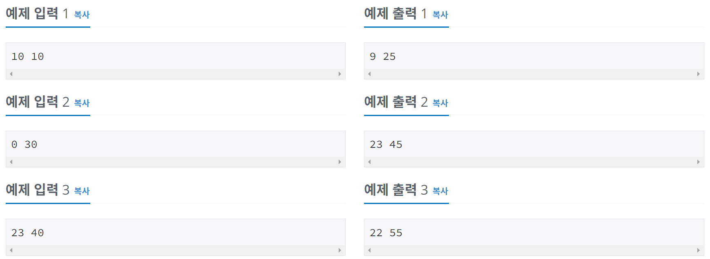
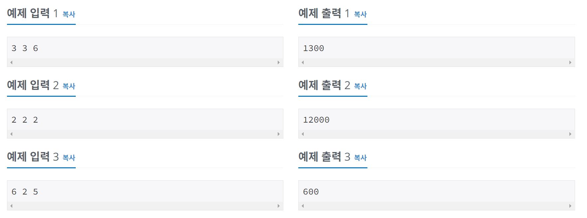
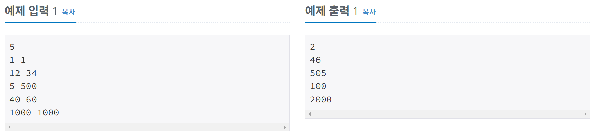
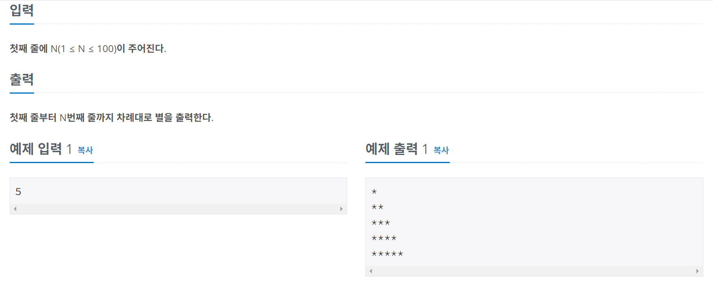

# 알고리즘 공부 2일차

### 백준 문제 :

1330, 9498, 2753, 14681, 2884, 2525, 2480, 2739, 10950, 8393, 15552, 2741, 2742, 11021, 11022, 2438, 2439

---

# 주요 문제 정리

## 1330. 두 수 비교하기

<br/>

> ### [문제](https://www.acmicpc.net/problem/1330)

#### 두 정수 A와 B가 주어졌을 때, A와 B를 비교하는 프로그램을 작성하시오.

<br/>

> ### 예제 입력

#### 첫째 줄에 A와 B가 주어진다. A와 B는 공백 한 칸으로 구분되어져 있다.

<br/>

> ### 예제 출력

#### 첫째 줄에 다음 세 가지 중 하나를 출력한다.

- A가 B보다 큰 경우에는 '>'를 출력한다.
- A가 B보다 작은 경우에는 '<'를 출력한다.
- A와 B가 같은 경우에는 '=='를 출력한다.

<br/>

> ### 정답 코드

```python
A, B = map(int, input().split())
print('>' if A>B else('<' if A<B else '=='))
```

<br/>

> ### 배운 개념

- ### print문 안에 조건문 사용하기

  - 구조

  ```python
  #if 문
  print('참' if 조건 else '거짓')
  #elif 문
  print('참' if 조건 else ('참' if 조건 else '거짓'))
  ```

---

<br/>

## 2884. 알람 시계

<br/>

> ### [문제](https://www.acmicpc.net/problem/2884)

#### 45분 일찍 알람 설정하기

<br/>

> ### 예제 입력

#### 첫째 줄에 두 정수 H와 M을 입력한다. (상근이가 설정한 놓은 알람 시간 H시 M분을 의미한다.)

<br/>

> ### 예제 출력

#### 첫째 줄에 상근이가 창영이의 방법을 사용할 때, 설정해야 하는 알람 시간을 출력한다.



<br/>

> ### 내 코드

```python
hour, minute = map(int, input().split())

if minute>=45:
    minute -= 45
else:
    minute = minute+15
    if hour>0:
        hour -= 1
    else:
        hour += 23

print(hour, minute)
```

<br/>

> ### 다른 방법

이 문제를 이렇게 간단하게 풀 수도 있다.

```python
a,b=map(int,input().split())
x=a*60+b-45
print(x//60%24,x%60)
```

예제 입력 1번의 경우는 계산이 이해가 되는데 예제 입력 2번의 경우가 이해가 되지 않았다.
<br/>왜냐면 a:0, b:30의 경우, x: -15가 되는데 어떻게 출력이 23 45 가 되는지 이해가 안갔다.
<br/>이를 이해하려면 파이썬이 음수를 어떻게 계산하는지를 알아야한다.

- ### 파이썬의 음수 계산 (%, // 연산)

  - 파이썬에서 // 연산은 몫에 대해서 내림을 사용한다.
  - 만약 양수의 경우 2.333 -> 2 로, 음수의 경우 -2.333 -> -3 으로, 음수의 경우 정수부가 바뀌는 현상이 나타난다.
  - 파이썬에서 % 연산자는 항상 분모와 기호가 같은 부호로 반환된다.
  - 예시

  ```python
  7 / 3 -> (3 * 3) + 1 # 즉, 나머지는 1
  -7 / 3 -> (3 * -3) + 2 # 즉, 나머지는 2
  7 / -3 -> (-3 * -3) + (-2) #즉, 나머지는 -2
  ```

  그래서 문제에 대입해보면
  -15//60 은 -1이 되고, -1%24의 계산 결과는 -1/24 = 24\*(-1) + 23 이기 때문에 23이 된다.
  <br/> 따라서 23 45 가 출력된다.

---

<br/>

## 2480. 주사위 세개

<br/>

> ### [문제](https://www.acmicpc.net/problem/2480)

#### 1에서부터 6까지의 눈을 가진 3개의 주사위를 던져서 다음과 같은 규칙에 따라 상금을 받는 게임이 있다.

1. 같은 눈이 3개가 나오면 10,000원+(같은 눈)×1,000원의 상금을 받게 된다.
2. 같은 눈이 2개만 나오는 경우에는 1,000원+(같은 눈)×100원의 상금을 받게 된다.
3. 모두 다른 눈이 나오는 경우에는 (그 중 가장 큰 눈)×100원의 상금을 받게 된다.

<br/>

> ### 예제 입출력

#### 첫째 줄에 3개의 눈이 빈칸을 사이에 두고 각각 주어진다.

<br/>

> ### 예제 출력

#### 첫째 줄에 게임의 상금을 출력 한다.



<br/>

> ### 내 코드

```python
a, b, c = map(int, input().split())

if a == b == c: print(10000 + a * 1000)
else:
    if a==b or a==c: print(1000 + a * 100)
    elif b==c: print(1000 + b * 100)
    else:
        list = [a,b,c]
        print(max(list)*100)
```

<br/>

> ### 다른 방법

```python
1. lst = sorted(list(map(int, input().split())))
2.
3. if len(set(lst)) is 1:
4.     print(10000 + lst[0]*1000)
5. elif len(set(lst)) is 2:
6.     print(1000 + lst[1]*100)
7. else:
8.     print(lst[2]*100)
```

map 함수의 반환값은 map 객체이기 때문에 list나 tuple로 형변환을 시켜서 사용해줘야 한다.
<br/> list로 형변환해주면 입력한 각각의 숫자가 list의 원소로 들어가고, sorted 함수를 이용하여 리스트의 원소들을 오름차순 정렬 해준다.
<br/> set 자료형은 중복을 허용하지 않는다. 그래서 3번째 줄은 주사위의 눈이 모두 같게 나온 경우이다. 5번째 줄은 두 개의 눈이 같은 경우를 , 7번째 줄은 모든 눈이 다른 경우를 나타낸다.

---

<br/>

## 15552. 빠른 A+B

<br/>

> ### [문제](https://www.acmicpc.net/problem/15552)

#### 본격적으로 for문 문제를 풀기 전에 주의해야 할 점이 있다. 입출력 방식이 느리면 여러 줄을 입력받거나 출력할 때 시간초과가 날 수 있다는 점이다. Python을 사용하고 있다면, input 대신 sys.stdin.readline을 사용할 수 있다. 단, 이때는 맨 끝의 개행문자까지 같이 입력받기 때문에 문자열을 저장하고 싶을 경우 .rstrip()을 추가로 해 주는 것이 좋다. 또한 입력과 출력 스트림은 별개이므로, 테스트케이스를 전부 입력받아서 저장한 뒤 전부 출력할 필요는 없다. 테스트케이스를 하나 받은 뒤 하나 출력해도 된다.

<br/>

> ### 예제 입출력



<br/>

> ### 내 코드

```python
import sys
a = int(input())
for _ in range(a):
    b, c = map(int, sys.stdin.readline().split())
    print(b+c)
```

> ### 배운 개념

- ### for문

  - 구조

  ```python
  for 변수 in 리스트(또는 튜플, 문자열):
      수행할 문장1
      수행할 문장2
      ...
  ```

  ```python
  # 1부터 n-1까지 출력
  for i in range(1,n):
      print(i)
  ```

  ```python
  # 10번 출력
  for i in range(10):
    print("hi")
  ```

- ### 입력받기 (sys.stdin.readline)
  - 한 두줄 입력받는 문제들과 다르게, 반복문으로 여러줄을 입력받아야 할 때는 input()으로 입력받을 경우 시간초과가 발생할 수 있다. 그래서 반복문으로 여러줄 입력받는 상황에서는 반드시 sys.stdin.readline()을 사용해야 한다.
  - 한 개의 정수를 입력받을 때
  ```python
  import sys
  a = int(sys.stdin.readline())
  # sys.stdin.readline() 은 한 줄 단위로 입력받기 때문에 개행문자가 같이 받아진다.
  # 문자열을 저장하고 싶을 경우에는 rstrip()함수를 이용해서 개행문자를 제거해야 한다.
  ```

---

<br/>

## 2438. 별 찍기 - 1

<br/>

> ### [문제](https://www.acmicpc.net/problem/2438)

#### 첫째 줄에는 별 1개, 둘째 줄에는 별 2개, N번째 줄에는 별 N개를 찍는 문제

<br/>

> ### 예제 입출력



<br/>

> ### 내 코드

```python
a = int(input())
for i in range(1, a+1):
    for _ in range(i):
        print("*", end="")
    print()
```

<br/>

> ### 다른 방법

```python
for i in range(1,int(input())+1):
  print('*'*i)
```

파이썬은 문자열에 대해 덧셈, 곱셈이 가능하다
굳이 중첩 for문을 쓰지 않고 print 함수 안에서 문자열을 i 만큼 곱해주면 된다.
