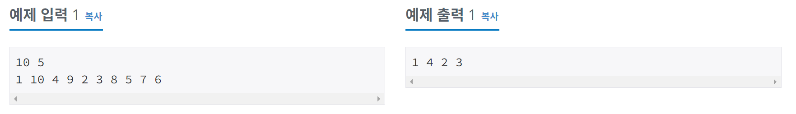
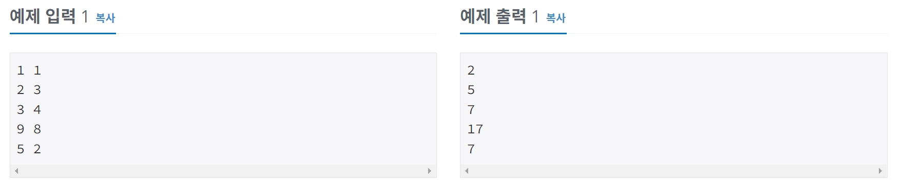

# 알고리즘 공부 3일차

### 백준 문제 :

10871, 10952, 1110

---

# 주요 문제 정리

## 10871. X보다 작은 수

<br/>

> ### [문제](https://www.acmicpc.net/problem/10871)

#### 정수 N개로 이루어진 수열 A와 정수 X가 주어진다. 이때, A에서 X보다 작은 수를 모두 출력하는 프로그램을 작성하시오.

<br/>

> ### 예제 입출력



<br/>

> ### 내 코드 [ 메모리 : 30840 KB / 시간 76ms ]

```python
a, b = map(int, input().split())
list = list(map(int, input().split()))
result = ""
for i in range(a):
    if(list[i]<b): result += f'{list[i]} '
print(result)
```

<br/>

> ### 더 효율적인 코드 [ 메모리 : 30840 KB / 시간 72ms ]

```python
a, b = map(int, input().split())
list1 = input().split()
list2 = [x for x in list1 if int(x)<b]
print(" ".join(list2))
```

- ## 리스트를 문자열로 일정하게 합쳐주는 join 함수

  - 형태: `'구분자'.join(리스트)`
  - 예시

  ```python
  a = ['a', 'b', 'c']
  print(a)
  >> ['a', 'b', 'c']

  #리스트를 문자열로 합치기
  result = "_".join(a)
  print(result)
  >> a_b_c
  ```

- ## 리스트에서 원하는 요소만 추출하기(필터링하기)

  - 파이썬은 아주 쉽게 list에서 원하는 요소만 추출해서 새로운 list를 만들 수 있다.
  - ### 방법 1 : filter 함수 사용하기
    - filter 함수를 사용하기 위해서는 `bool을 변환하는 함수`와 `추출할 대상인 list(또는 Iterable)` 가 필요하다.
      <br/> 예를 들어서, 내가 `originamList = [1, 10, 4, 9, 2, 3, 8, 5, 7, 6]` 에서 5보다 큰 수만 뽑아내고 싶다고 해보자. 먼저 5보다 크면 True를 반환하는 함수를 만든다. 다음, 그 함수를 인자로 하는 filer 함수를 쓰면 끝이다.
    - 예시
    ```python
    originamList = [1, 10, 4, 9, 2, 3, 8, 5, 7, 6]
    def isBiggerThanFive(x):
        return x>5
    newList = list(filter(isBiggerThanFive, originalList))
    print(newList)
    >> [10, 9, 8, 7, 6]
    ```
  - ### 방법 2 : List Comprehension 사용하기
    - `newList = [x for x in iterable]`
    - 기본적인 List Comprehension은 위와 같은 형태로 사용한다.
    - iterable은 반복(열거) 가능한 list와 같은 것, for x 의 x는 iterable의 item으로 사용할 변수, 제일 앞에 있는 x는 각각의 iteralbe 원소를 어떻게 변환할지 적는다.
    - 예시
    ```python
    # iterable 원소들을 모두 2배한 리스트 만들기
    [2*x for x in iterable]
    ```
    - 기본적인 형태는 이렇고 어떤 list를 추출하려면 조건이 필요하기 때문에 Nested List Comprehension을 사용한다.
    - 형태는 이렇다. `newList = [x for x in iterable if 조건]`
    - 예시
    ```python
    # originalList에서 5보다 큰 원소를 추출한 newList 만들기
    newList = [x for x in originalList if x>5]
    ```

---

<br/>

## 10951. A+B -4

<br/>

> ### [문제](https://www.acmicpc.net/problem/10951)

#### 두 정수 A와 B를 입력받은 다음, A+B를 출력하는 프로그램을 작성하시오.

<br/>

> ### 예제 입출력



<br/>

> ### POINT!

계속 입력받다가 ctrl + Z 를 누르면 프로그램이 종료되어야 한다.
<br/> 처음에 무한 while 문을 이용해서 코드를 짰었는데, while문은 ctrl + Z 가 먹히지 않기 때문에 프로그램이 종료되지 않아 런타임 오류가 발생한다.

<br/>

> ### 정답 코드 [ 메모리 : 30840 KB / 시간 76ms ]

```python
for line in sys.stdin:
    print(sum(map(int,line.split())))
```

<br/>

> ### 배운 개념

- ## sys.stdin - 여러줄 입력받을 때

  - `sys.stdin`은 `^Z`를 입력받으면 종료되며, 개행문자까지 입력된다.
  - 예시

  ```python
  nums = []
  for line in sys.stdin:
      nums.append(line)
  print(nums)

  """
  1
  2
  3
  4
  5
  ^Z
  ['1\n', '2\n', '3\n', '4\n', '5\n']
  """
  ```

- ## sys.stdin.readLine() - 한 줄 입력
  - sys.stdin 과 다르게 한줄씩 입력을 받는다.
  - readLine()을 이용해서 여러 줄 입력받으려면 for문을 사용하면 된다.

<br/>

> 출처

- [리스트에서 원하는 요소만 추출하기](https://coding-groot.tistory.com/21)
- [sys.stdin](https://developeryuseon.tistory.com/90)
