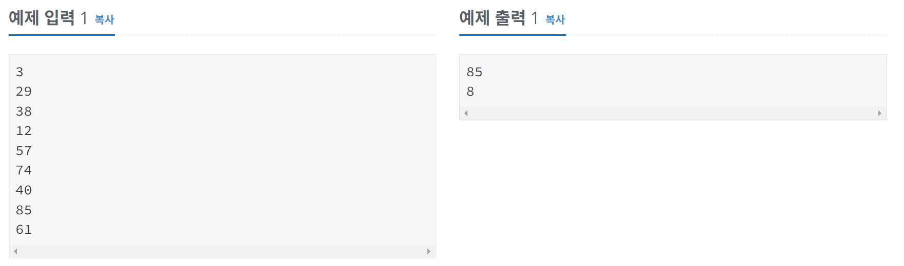
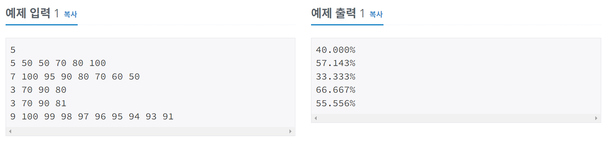

# 알고리즘 공부 4일차

### 백준 문제 :

10818, 2562, 2577, 3052, 1546, 8958, 4344

---

# 주요 문제 정리

## 2562. 최댓값

<br/>

> ### [문제](https://www.acmicpc.net/problem/2562)

#### 9개의 서로 다른 자연수가 주어질 때, 이들 중 최댓값을 찾고 그 최댓값이 몇 번째 수인지를 구하는 프로그램을 작성하시오. <br/>예를 들어, 서로 다른 9개의 자연수 <br/>3, 29, 38, 12, 57, 74, 40, 85, 61<br/>이 주어지면, 이들 중 최댓값은 85이고, 이 값은 8번째 수이다.

<br/>

> ### 예제 입출력



<br/>

> ### 내 코드 [ 메모리 : 30840 KB / 시간 72ms ]

```python
import sys
list = []
for _ in range(9):
    list.append(int(sys.stdin.readline()))
max = max(list)
print(max)
for i in range(9):
    if(list[i] == max):
        print(i+1)
        break
```

<br/>

> ### POINT!

## 1. 9개의 입력을 어떻게 리스트에 넣을 것인가

두 가지 방법이 있다.
<br/>1. for문을 돌면서 list에 append를 해준다. (내가 짠 코드 처럼)
<br/>2. 리스트 안에 for문을 포함한다.

`list = [int(sys.stdin.readline()) for _ in range(9)]`

## 2. 최댓값의 인덱스를 찾는 방법은?

나는 우선 max 함수를 통해 최댓값을 구하고, for문을 돌면서 list의 원소와 최댓값을 비교해 인덱스를 찾는 방법을 사용하였다. <br/>
그러나 파이썬에는 배열에서 값의 위치를 찾아주는 index 함수가 있다. 만약 중복된 값이 있으면 가장 최소의 위치를 리턴한다.
<br/>
만약 찾으려는 값이 86이라면
`list.index(86)` 로 간단하게 86의 인덱스를 찾을 수 있다.

<br/>

---

## 4344. 평균은 넘겠지

<br/>

> ### [문제](https://www.acmicpc.net/problem/4344)

#### 대학생 새내기들의 90%는 자신이 반에서 평균은 넘는다고 생각한다. 당신은 그들에게 슬픈 진실을 알려줘야 한다.

<br/>

> ### 예제 입출력
>
> 첫째 줄에는 테스트 케이스의 개수 C가 주어진다.

둘째 줄부터 각 테스트 케이스마다 학생의 수 N(1 ≤ N ≤ 1000, N은 정수)이 첫 수로 주어지고, 이어서 N명의 점수가 주어진다. 점수는 0보다 크거나 같고, 100보다 작거나 같은 정수이다.

각 케이스마다 한 줄씩 평균을 넘는 학생들의 비율을 반올림하여 소수점 셋째 자리까지 출력한다.



<br/>

> ### 내 코드 [ 메모리 : 30840 KB / 시간 68ms ]

```python
import sys
a = int(input())
for _ in range(a):
    b = list(map(int, sys.stdin.readline().split()))
    avg = sum(b[1:])/b[0]
    c = [x for x in b[1:] if x>avg]
    result = len(c)/len(b[1:])*100
    print(f'{result:.3f}%')
```

<br/>

> ### POINT!

## 1. 리스트의 일정 부분 합 구하기

각 테스트 케이스의 첫 숫자는 학생의 수를 의미하기 때문에, 점수의 평균을 내려면 두 번째 숫자부터 계산을 해줘야한다. <br/> 이를 계산하려면 슬라이싱 기능과 sum 메서드를 이용하면 된다. <br/>
먼저 `a[1:]` 를 통해서 점수 데이터만 있는 리스트를 만들고, `sum(a[1:])` 을 통해서 점수의 합을 계산할 수 있다.

## 2. 반올림하여 소수점 셋째 자리 까지 출력하기

### 1. round 함수 이용하기

- round(반올림하고자 하는 값, 자릿수)
- 예시

```python
a = round(1.23456)  # 소수점 첫째자리에서 반올림 (1)
b = round(1.23456, 0)   # 소수점 첫째자리에서 반올림 (1.0)
c = round(1.23456, 1)   # 소수점 둘째자리에서 반올림 (1.2)
d = round(1.23456, 2)   # 소수점 셋째자리에서 반올림 (1.23)
e = round(1.23456, 3)   # 소수점 넷째자리에서 반올림 (1.235)
```

### 2. 출력 자릿 수 지정 : f-string 사용

- round 함수를 쓰지않고 바로 반올림한 값을 출력할 수 있다.
- 전체 자릿수보다 더 많은 숫자를 지정하면 남은 공간은 뒤에 0을 채워서 출력된다.
- 예시

```python
pi = 3.1416
print(f'소수 두번째 자리까지 표기 : {pi:.2f}')
print(f'소수 세번째 자리까지 표기 : {pi:.3f}')
```

### 3. 출력 자릿 수 지정 : "{}".format() 함수 사용

- 예시

```python
pi = 3.1416
print("소수 두번째 자리까지 표기 : {:.2f}".format(pi))
print("소수 세번째 자리까지 표기 : {:.3f}".format(pi))
```

### 4. 출력 자릿 수 지정 : %.2f 형식

- 예시

```python
pi = 3.1416
print("소수 두번째 자리까지 표기 : %.2f"%pi)
 rint("소수 세번째 자리까지 표기 : %.3f"%pi)
```

---

<br/>

# 기타 개념 정리

## str은 iterable 하다.

- str은 iterable 하기 때문에 map 함수의 인자로 넘겨서 처리할 수 있다.
- 예시
  ```python
  a = '1700'
  b = list(map(int, a))
  print(b)
  >> [1, 7, 0, 0]
  ```

## 리스트에서 특정 요소의 개수 구하기 (count)

- count 함수를 이용하면 리스트에서 특정 요소가 몇 개 있는지 구할 수 있다.
- 예를 들어, 위 예시에 이어서 b 리스트에서 0이 몇개인지 구하려면 `b.count(0)` 으로 구할 수 있다.
