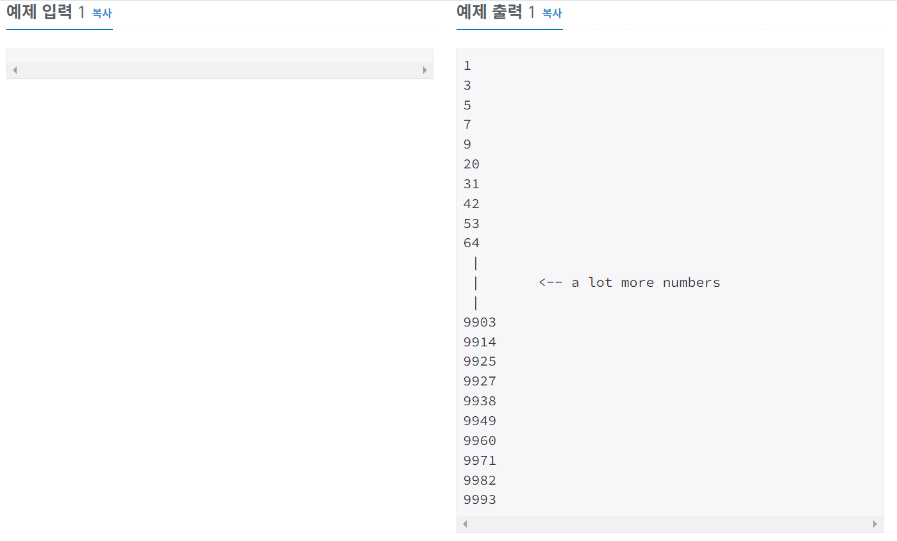

# 알고리즘 공부 5일차

### 백준 문제 :

15596, 4673, 1065, 11654, 11720, 10809, 2675, 1157

---

# 주요 문제 정리

## 4673. 셀프 넘버

<br/>

> ### [문제](https://www.acmicpc.net/problem/4673)

#### 양의 정수 n에 대해서 d(n)을 n과 n의 각 자리수를 더하는 함수라고 정의하자. 예를 들어, d(75) = 75+7+5 = 87이다. <br/>양의 정수 n이 주어졌을 때, 이 수를 시작해서 n, d(n), d(d(n)), d(d(d(n))), ...과 같은 무한 수열을 만들 수 있다. <br/> 예를 들어, 33으로 시작한다면 다음 수는 33 + 3 + 3 = 39이고, 그 다음 수는 39 + 3 + 9 = 51, 다음 수는 51 + 5 + 1 = 57이다. 이런식으로 다음과 같은 수열을 만들 수 있다. <br/>33, 39, 51, 57, 69, 84, 96, 111, 114, 120, 123, 129, 141, ... <br/>n을 d(n)의 생성자라고 한다. 위의 수열에서 33은 39의 생성자이고, 39는 51의 생성자, 51은 57의 생성자이다. 생성자가 한 개보다 많은 경우도 있다. 예를 들어, 101은 생성자가 2개(91과 100) 있다. <br/>생성자가 없는 숫자를 셀프 넘버라고 한다. 100보다 작은 셀프 넘버는 총 13개가 있다. 1, 3, 5, 7, 9, 20, 31, 42, 53, 64, 75, 86, 97 <br/>10000보다 작거나 같은 셀프 넘버를 한 줄에 하나씩 출력하는 프로그램을 작성하시오.

<br/>

> ### 예제 입출력



<br/>

> ### 내 코드 [ 시간 236ms ]

```python
a = [x for x in range(0,10001)]
for i in range(0,10001):
    result = i
    for j in str(i):
        result += int(j)
    if result in a:
        a.remove(result)
print(*a, sep="\n")
```

<br/>

> ### POINT!

## 1. 생성자가 없는 수를 어떻게 찾을까?

생성자가 없는 수를 찾는 것 보다는 방향을 틀어서 0 ~ 10000 중에서 생성자가 있는 수를 제거하는 방법이 더 쉬울 것 같아서 이 방법을 택했다.

## 2. 생성자가 있는 수는 어떻게 찾을까?

13 은 13 + 1 + 3 = 17의 생성자가 된다. <br/> 즉 17은 생성자가 있는 수다.
a 라는 숫자가 있으면 a 와 a의 각자리 수의 합을 더한 수는 a 라는 생성자가 있는 수다.
나는 이를 코드로 이렇게 구현했다.

1. 우선 a의 각자리를 구하기 쉽게 a를 str으로 만들어준다.
2. for 문을 돌면서 a에 각 자리 수를 더해준다.

```python
result = a
for i in str(a):
    result += int(i)
```

3. result는 생성자가 있는 수가 된다.

## 3. 해결

0~10000 의 숫자가 있는 리스트 a 를 만든 후, 0부터 for문을 돌면서 d(n) 함수의 결과로 나온 수, 즉 생성자가 있는 수를 리스트 a에서 제거해주었다.

## 4. 주의할 점

1. 리스트.remove(원소) 함수를 이용해서 특정 원소를 삭제할 수 있다. 그러나 이미 삭제된 원소를 또 삭제하려고 하면 오류가 난다. 이를 방지하기 위해 만약 리스트에 해당 원소가 있는 경우에만 삭제하도록 if문으로 처리해주었다.
2. Unpacking Operator *를 사용하면 리스트를 구분자를 넣어서 바로 출력할 수 있다. `print(*리스트, sep='\n')` 이와 같이 \*를 사용해서 unpacking 한 데이터로 전달해야 sep이 적용된다.

---

<br/>

## 1065. 한수

<br/>

> ### [문제](https://www.acmicpc.net/problem/1065)

#### 어떤 양의 정수 X의 각 자리가 등차수열을 이룬다면, 그 수를 한수라고 한다. 등차수열은 연속된 두 개의 수의 차이가 일정한 수열을 말한다. N이 주어졌을 때, 1보다 크거나 같고, N보다 작거나 같은 한수의 개수를 출력하는 프로그램을 작성하시오.

<br/>

> ### 예제 입출력


<br/>

> ### 내 코드 [ 시간 76ms ]

```python
a = int(input())
if a<= 99: num = a
else:
    num = 99
    for b in range(100, a+1):
        str_b = str(b)
        if int(str_b[1])-int(str_b[0]) == int(str_b[2])-int(str_b[1]):
            num += 1
print(num)
```

<br/>

> ### POINT!

## 1. 한수의 개수를 어떻게 구할까?

한수는 각 자리 수가 등차수열을 이루는 수이다.
1~99 까지의 수는 등차수열을 판단할 다른 자리 수가 없기 때문에 모두 한수이다. 따라서 케이스를 두개로 나누어서 구현해준다.

### 1. 만약 입력된 수 a 가 100보다 작으면 한수의 개수는 a와 같다.

### 2. a가 99보다 크다면 한수인지 계산하는 코드를 짜줘야한다.

- 100부터 a 까지 for문을 돌면서 한수의 개수를 세줘야한다.
- 각 자리 수를 추출하기 위해 우선 a를 str으로 바꿔준다.
- (십의 자릿 수 - 백의 자릿수) 한 값과, (일의 자릿수 - 십의 자릿수) 한 값이 같은지 검사를 해준다. 같으면 등차수열이 성립하므로 한수이다.
- (99 + 한수의 개수)를 출력해준다.

---

<br/>

## 1157. 단어 공부

<br/>

> ### [문제](https://www.acmicpc.net/problem/1157)

#### 알파벳 대소문자로 된 단어가 주어지면, 이 단어에서 가장 많이 사용된 알파벳이 무엇인지 알아내는 프로그램을 작성하시오. 단, 대문자와 소문자를 구분하지 않는다.

<br/>

> ### 예제 입출력


<br/>

> ### 내 코드 [ 시간 280ms ]

```python
def find_keys(dict, val):
    return list(key for key, value in dict.items() if value == val)

a = input().upper()
result = {}
for i in a:
    if i in result:
        result[i] += 1
    else: result[i] = 1
max_value = max(result.values())
key_list = find_keys(result, max_value)
if len(key_list) == 1:
    print(key_list[0])
else:
    print("?")
```

<br/>

> ### POINT!

## 1. 대문자와 소문자를 구분하지 않는다.

이 문제는 입력문자의 대문자와 소문자를 구분하지 않는다. <br/>
따라서 입력문자에 upper() 함수나 lower() 함수를 적용시켜서 통일해줘야한다. <br/>
이 문제의 경우 출력값이 대문자이기 때문에 upper() 함수를 적용해줬다.

## 2. 많이 사용된 알파벳을 어떻게 구할까?

입력받은 문자열의 알파벳의 for문을 돌면서 딕셔너리에 `key: 알파벳, value: 나온 횟수` 형식으로 저장해줬다. <br/> 딕셔너리에서 가장 큰 값을 찾는 방법은 `max(딕셔너리.values())` 해주면 된다. <br/> `딕셔너리.values()` 는 딕셔너리의 value만 모아서, `딕셔너리.keys()` 는 key만 모아서, `딕셔너리.items()` 는 key와 value의 쌍을 튜플로 묶은 값의 리스트를 만들어준다.
_(참고로 튜플은 리스트와 거의 비슷하지만, 리스트는 값의 생성, 삭제, 수정이 가능하지만 튜플은 그 값을 바꿀 수 없다.)_

## 3. 가장 많이 사용된 알파벳이 여러개 존재하는 경우 처리

가장 많이 사용된 알파벳이 여러개 존재할 경우 "?"를 출력해줘야 한다. <br/> 나는 find_keys 라는 딕셔너리에서 해당 값을 가진 key 들을 모두 찾아 반환해주는 함수를 만들어서 max value 값을 파라미터로 넘겨주었다. <br/>만약 max value 값을 가진 키가 여러개 존재하는 경우는 "?"를 출력해주고, 키가 한개만 존재하는 경우는 해당 키를 출력해주었다.

---

<br/>

# 기타 개념 정리

## 파이썬 아스키 코드 변환

- 알파벳 -> 아스키코드 : `ord('a')` >> 97 출력
- 아스키코드 -> 알파벳 : `chr(97)` >> a 출력

## print() 줄바꿈 없애기

- `print()`를 호출하면 자동 줄바꿈 된다.
- for문을 돌면서 print() 할 때 한줄에 출력되게 하고싶을 때가 있다. 줄바꿈을 없애고 띄어쓰기로 구분하려면 end에 원하는 구분자를 적어주면 된다.
- 예시

  ```python
  #기본 print 함수
  for i in range(10):
      print(i)
  >> 0
  1
  2
  3
  4
  .
  .
  10

  # end 구분자 추가
  for i in range(10):
      print(i, end=" ")
  >> 0 1 2 3 .. 10
  ```

## find() / index() 함수 차이점

- 변수.find() / 변수.index() 는 모두 동일하게 변수에서 괄호 안의 값을 찾아 처음 위치를 반환해준다.
- 차이점

  - find() 함수는 `찾는 문자가 없는 경우 -1`을 출력한다.
  - `문자열에서만 사용 가능`하다. 리스트, 튜플, 딕셔너리 자료형에서는 find 함수를 사용할 수 없다. 만일 사용하면 AttributeError가 발생한다.

    <br/>

  - index() 함수는 `찾는 문자가 없는 경우 ValueError`가 발생한다.
  - `문자열, 리스트, 튜플 자료형에서 사용 가능`하고 딕셔너리 자료형에는 사용할 수 없어 AttributeError 에러가 발생한다.

## 참고

- https://ooyoung.tistory.com/78
