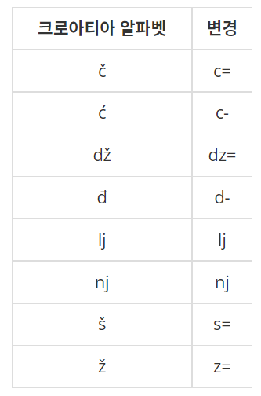
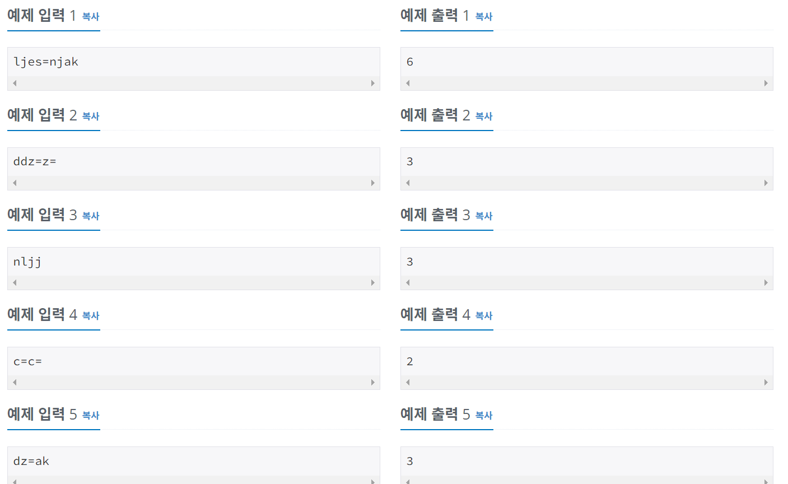

# 알고리즘 공부 6일차

### 백준 문제 :

1152, 2908, 5622, 2941(실패)

---

# 주요 문제 정리

## (실패) 2941. 크로아티아 알파벳

<br/>

> ### [문제](https://www.acmicpc.net/problem/2941)



#### <br/>예를 들어, ljes=njak은 크로아티아 알파벳 6개(lj, e, š, nj, a, k)로 이루어져 있다. 단어가 주어졌을 때, 몇 개의 크로아티아 알파벳으로 이루어져 있는지 출력한다.<br/>dž는 무조건 하나의 알파벳으로 쓰이고, d와 ž가 분리된 것으로 보지 않는다. lj와 nj도 마찬가지이다. 위 목록에 없는 알파벳은 한 글자씩 센다.

<br/>

> ### 예제 입출력



<br/>

> ### 내 코드 (실패)

```python
a = input()
b = ["c=", "c-", "dz=", "d-", "lj", "nj", "s=", "z="]
count = 0
for i in b:
    if a.find(i) != -1:
        count += 1
        a = a.replace(i, "")
print(count + len(a))
```

<br/>

> ### POINT!

## <내가 짠 알고리즘> <br/>

1. 미리 크로아티아 알파벳 리스트를 만든다.
2. 입력받은 문자열에서 크로아티아 알파벳이 있는지 확인 후, 있으면 카운트 + 1 을 하고 문자열에서 제거한다.
3. 더 이상 제거할 크로아티아 알파벳이 없으면 카운트에 남은 문자열의 길이를 더하는 방식으로 알고리즘을 짰다.

## <실패 요인>

예제 입력 3인 "nljj"의 경우, 내가 짠 코드에 대입을 하면 크로아티아 알파벳 "lj"가 문자열에서 제거되면서 남은 "n"과 "j"가 합쳐져 또 다른 크로아티아 알파벳이 의도치않게 만들어지기 때문에 잘못된 답이 나오게 된다. ㅠㅠ

## <해결>

접근은 잘 했지만 내가 replace 함수를 통해 크로아티아 알파벳을 아예 제거를 해버려서 문제가 생긴 것 같다..! 알파벳을 제거 하지않고 "\*" 별 문자로 대체를 하면 남은 알파벳이 합쳐져서 크로아티아 알파벳이 되는 문제가 발생하지 않는다. 그리고 크로아티아 알파벳이 별 문자 하나로 대체되기 때문에 알파벳의 개수를 세기도 수월해진다! (count 변수를 따로 사용하지 않아도 된다!)

## <수정 코드>

```python
a = input()
b = ["c=", "c-", "dz=", "d-", "lj", "nj", "s=", "z="]
for i in b:
    if a.find(i) != -1:
        a = a.replace(i, "*")
print(len(a))
```

---

<br/>

# 기타 개념 정리

## 파이썬 문자열 뒤집기

1. for문을 사용한다.
2. 리스트 reverse 함수를 사용한다

- 문자열에는 reverse 라는 메서드가 존재하지 않기 때문에 리스트의 reverse 메서드를 사용해야 한다.
- 문자열을 list로 변환한 다음 reverse 함수를 사용하면 된다.

3. 문자열 슬라이싱을 이용한다. `[::-1]`

- 문자열 슬라이싱은 `문자열[시작:끝:규칙]` 형태로 사용한다.
- 규칙에는 1이 들어가는 것이 디폴트이며, 1이 들어가게 되면 문자열을 앞에서부터 하나씩 잘라서 새로운 문자열을 만들어준다.
- 규칙에 2를 넣는다면 한칸씩 띄워서 새로운 문자열을 만들어준다.
- 규칙에 -1을 넣는다면 뒤에서부터 잘라서 새로운 문자열을 만들어준다.
- 예시

```python
a = "HELLO"
print(a[::2])
>> HLO
print(a[::-1])
>> OLLEH
```

## 파이썬 문자열 포함여부 확인하는 법

1. if something in string

   - 예시

   ```python
   str = "Hello world, python"
   if "world" in str:
      print("Found world")
   else:
      print("Not found world")

    >>> Found world
   ```

2. str.find() 함수 이용
   - find()는 문자열에 인자로 전달된 문자열이 존재할 때, 문자열의 위치에 해당하는 index를 리턴한다.
   - 문자열이 존재하지 않으면 -1을 리턴한다.

<br/>

---

<br/>

## 참고

- https://blockdmask.tistory.com/581
- https://codechacha.com/ko/python-find-str-in-str/
