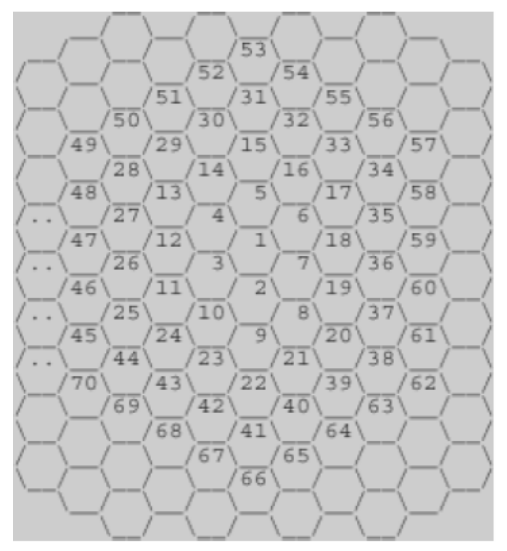
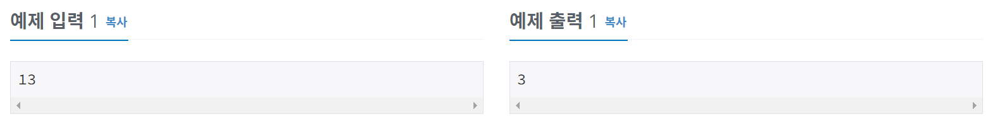
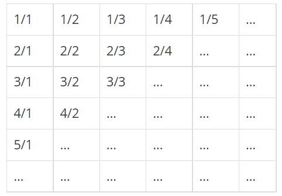
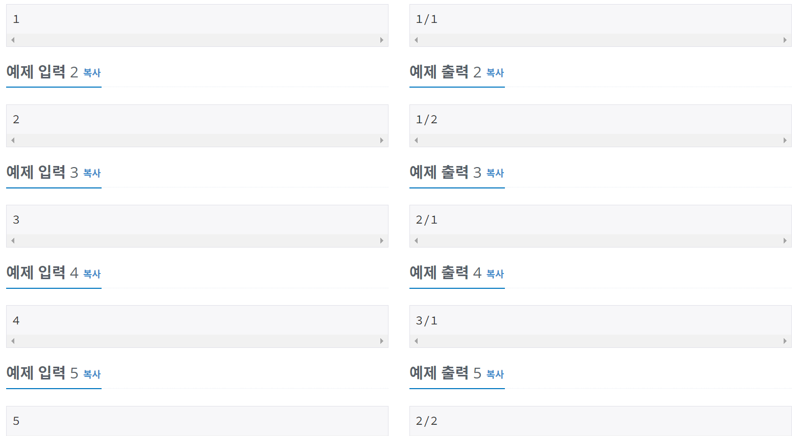
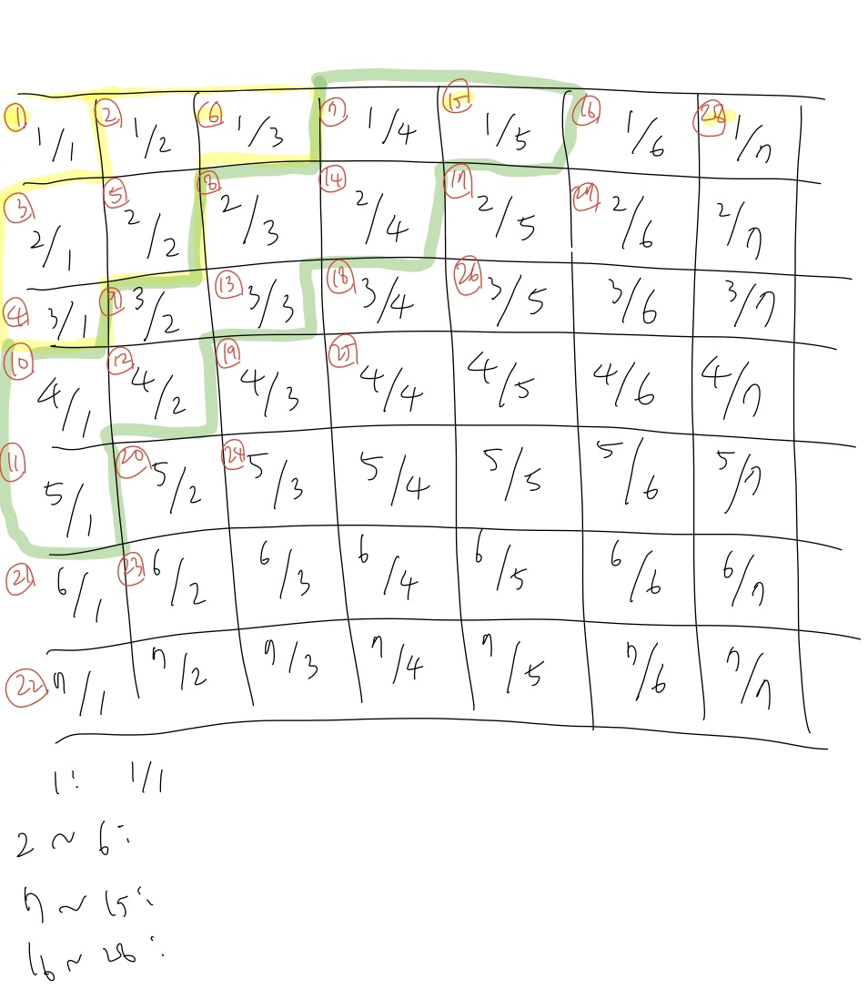

# 알고리즘 공부 7일차

### 백준 문제 :

1712, 2292(실패)

---

# 주요 문제 정리

## (실패) 2292. 벌집

<br/>

> ### [문제](https://www.acmicpc.net/problem/2292)



#### <br/>위의 그림과 같이 육각형으로 이루어진 벌집이 있다. 그림에서 보는 바와 같이 중앙의 방 1부터 시작해서 이웃하는 방에 돌아가면서 1씩 증가하는 번호를 주소로 매길 수 있다. 숫자 N이 주어졌을 때, 벌집의 중앙 1에서 N번 방까지 최소 개수의 방을 지나서 갈 때 몇 개의 방을 지나가는지(시작과 끝을 포함하여)를 계산하는 프로그램을 작성하시오. 예를 들면, 13까지는 3개, 58까지는 5개를 지난다.

<br/>

> ### 예제 입출력



<br/>

> ### 정답 코드

```python
n = int(input())
current = 1
plus = 6
count = 1
while n > current:
    current += plus
    plus += 6
    count += 1
print(count)
```

<br/>

> ### 풀이

이 문제는 1에서 주어진 n까지의 거리를 구하는 문제이다. 이를 구하려면 n이 몇 번째 겹에 속해있는지 구하면 된다. 어차피 같은 겹에 있다면 어느 위치에 있든지 거기까지 가는 거리는 똑같을테니까! (난 문제의 의도를 이해하지 못했었다..)
||1|2 ~ 7|8~19|20~37|
|:---:|:---:|:---:|:---:|:---:|
|1과의 거리|1|2|3|4|
(몇 번째 겹에 있는지)

각 겹의 마지막 숫자인 1, 7, 19...는 6의 배수만큼 커지는 수열이다. 이 규칙을 이용해서 입력값이 몇 번째 겹에 속하는지 계산해주었다.
<br/>while문을 이용해서 작성해주었고, 반복을 돌 때마다 6의 배수만큼 커지도록 plus 변수에 6을 더해 current 변수에 더해주었고 count 를 1씩 증가시켜주었다. 입력받은 값 n이 current 범위에 들어올때까지 계속해서 반복문을 돈다.

---

<br/>

## 1193. 분수찾기

<br/>

> ### [문제](https://www.acmicpc.net/problem/1193)



#### <br/>무한히 큰 배열에 다음과 같이 분수들이 적혀있다. 이와 같이 나열된 분수들을 1/1 → 1/2 → 2/1 → 3/1 → 2/2 → … 과 같은 지그재그 순서로 차례대로 1번, 2번, 3번, 4번, 5번, … 분수라고 하자.<br/>X가 주어졌을 때, X번째 분수를 구하는 프로그램을 작성하시오.

<br/>

> ### 예제 입출력



<br/>

> ### 내 코드

```python
a = int(input())
current = 1
plus = 5
#분모
parent = 1
#분자
child = 1
count = 1
#a의 범위 구하기
while a > current:
    current += plus
    plus += 4
    parent += 2
parent_copy = parent
#분수 구하기
while a != current:
    if count >= parent_copy:
        child -= 1
        if count > parent_copy:
            parent += 1
    else:
        parent -= 1
        child += 1
    count += 1
    current -= 1
print(f'{child}/{parent}')
```

<br/>

> ### 풀이


<br/>분수의 순서가 감이 안와 그려보았다.
그리고 그림과 같이 그룹을 나눴다. 표로 나타내면 아래와 같다.

|                         |  1  | 2 ~ 6 | 7~15 | 16~28 |
| :---------------------: | :-: | :---: | :--: | :---: |
| 그룹 마지막 순서의 분수 | 1/1 |  1/3  | 1/5  |  1/7  |

```python
while a > current:
    current += plus
    plus += 4
    parent += 2
parent_copy = parent
```

각 그룹 마지막 숫자인 1, 6, 15, 28 은 앞 수 보다 5 + 4\*n 만큼 커진다. 우선 입력된 a가 어느 그룹에 속하는지 계산해준다.
current는 a가 속한 그룹의 마지막 순서를 나타낸다. 그리고 마지막 순서가 나타내는 분수의 분모도 구해준다.(parent 변수가 분모이다. 각 그룹 마지막 순서의 분모의 분자는 어차피 1이므로 따로 구해줄 필요 없다.) 이제 a가 속한 그룹의 마지막 순서의 분수를 알게되었다.
<br/>

다시 위의 그림을 보면, 순서가 작아질수록 분모는 1씩 작아지고, 분자는 1씩 커지다가, 해당 그룹의 마지막 순서의 분모의 숫자만큼(parent copy 변수에 저장되어 있음) 순서가 작아지면 역으로 분모는 1씩 커지고, 분자를 1씩 작아지는 패턴을 볼 수 있다. 그래서 count 변수를 이용해서 지금 얼마만큼 순서가 작아졌는지 반복문을 돌때마다 1씩 증가시켜주었고, count 변수와 parent_copy 값이 같아지는 순간 분수를 다른 패턴으로 계산해줘야한다.
입력된 순서인 a가 current 순서와 같아질때까지 while문을 돌면서 분수를 구해줘야 한다.
<br/>

```python
#분수 구하기
while a != current:
    if count >= parent_copy:
        child -= 1
        if count > parent_copy:
            parent += 1
    else:
        parent -= 1
        child += 1
    count += 1
    current -= 1
print(f'{child}/{parent}')
```

만약 a가 8이라고 가정해보면, current 값은 a가 속한 초록색 그룹의 마지막 순서인 15를 나타내고, parrent_copy는 15번째 분수의 분모인 5를 나타낸다. 이 그룹은 순서가 작아질수록 분모는 1씩 작아지고, 분자는 1씩 커지다가 15에서부터 5번 작은 순서인 10번째 부터는 순서가 작아질수록 분모는 1씩 커지고, 분자는 1씩 작아지게 된다. 위는 이 과정을 구현한 코드이다.
