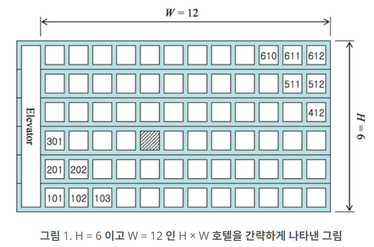

# 알고리즘 공부 8일차

### 백준 문제 :

2869, 10250, 2775(실패)

---

# 주요 문제 정리

## 2869. 달팽이는 올라가고 싶다

<br/>

> ### [문제](https://www.acmicpc.net/problem/2869)

#### <br/>땅 위에 달팽이가 있다. 이 달팽이는 높이가 V미터인 나무 막대를 올라갈 것이다. <br/>달팽이는 낮에 A미터 올라갈 수 있다. 하지만, 밤에 잠을 자는 동안 B미터 미끄러진다. 또, 정상에 올라간 후에는 미끄러지지 않는다.<br/>달팽이가 나무 막대를 모두 올라가려면, 며칠이 걸리는지 구하는 프로그램을 작성하시오.

<br/>

> ### Python3 코드

```python
import math

a, b, c = map(int, input().split())
result = math.ceil((c-a) / (a-b)) + 1
print(result)

```

<br/>

> ### Python3 코드 풀이

### 1. 문제 요약

낮에는 A 미터 올라가고, 밤에는 B미터 떨어지는 달팽이가 높이가 V인 나무를 모두 올라가려면 며칠이 걸리는지 구하는 문제이다.

문제를 풀 때 주의해야 될 점은 정상에 올라간 후에는 미끄러지지 않는다는 점이다.

### 2. 변수 입력받기

```python
a, b, c = map(int, input().split())
```

a는 낮에 달팽이가 올라가는 미터, b는 밤에 달팽이가 미끄러지는 미터, c는 나무 높이를 나타낸다.
띄어쓰기를 기준으로 입력 값을 나누고 각 값을 int로 변환하여 a, b, c에 넣어준다.

### 3. 나무 정상에 올라가기까지 걸리는 날짜 계산하기

```python
result = math.ceil((c-a) / (a-b)) + 1
```

달팽이는 낮에는 a 만큼 올라가고 밤에는 b 만큼 떨어진다. 그리고 마지막 날에는 a 만큼 올라가고 더 이상 떨어지지 않을 것이다. <br/>이를 식으로 나타내면 (a-b)\*x + a = c 가 된다. <br/>올라가고 내려가는 과정을 x 번 반복하고 마지막 날에는 a 만큼 올라가기만 한다.

<br/>
x를 구하는 식을 코드로 나타내면 위의 코드와 같다. 나무 높이에서 마지막 날에 올라간 거리인 a를 뺀 수를 a-b 로 나눠주면 x를 구할 수 있다. x는 날짜이기 때문에 math 라이브러리의 ceil 함수를 이용해서 소수점을 올림해주었다. x는 마지막 날을 제외하고 걸리는 기간이다. 따라서 총 걸린 날짜는 마지막 날인 하루를 더해줘야 하기 때문에 마지막에 1을 더해주었다.

### 4. math 라이브러리 사용하기

math 라이브러리를 이용하면 수학과 관련된 함수들을 사용할 수 있다.
<br/>해당 함수를 사용하려면 `import math`를 해야 한다.
<br/>ceil 함수는 올림, floor 함수는 내림을 할 때 사용한다.

---

<br/>

## 10250. ACM 호텔

<br/>

> ### [문제](https://www.acmicpc.net/problem/10250)

<br/>

> ### Python3 코드

```python
import math
import sys

a = int(sys.stdin.readline())
for _ in range(a):
    h, w, n = map(int, sys.stdin.readline().split())
    floor = n % h
    if floor == 0:
        floor = h
    number = math.ceil(n/h)
    print(f'{floor}{number}' if number > 9 else f'{floor}0{number}')
```

<br/>

> ### Python3 코드 풀이

### 1. 문제 요약



h개의 층이있고, 한 층에 w 개의 방이 있는 호텔이 있다. 먼저 오는 순서대로 1호실을 다 채우고 그 다음 2호실 그 다음 3호실을 채운다. 같은 호실 이라면 낮은 층을 먼저 준다. 예를 들어 1번 손님은 101호실, 2번 손님은 201호실, ... 6번 손님은 601호실, 7번 손님은 102 호실을 준다.
이때 n 번째 손님에게 배정될 방 번호를 구하는 문제이다.

### 2. 풀이 요약

첫 번째 손님이면 1층 1호, 두번째 손님이면 2층 1호.. 이러다가 h 번째 손님이면 h층 1호이고, h+1 번째 손님이면 다시 1층 2호로 배정된다. 즉 n 번째 손님이면 n을 h로 나눈 나머지에 해당하는 숫자 층에 배정해주면 된다. 그리고 1번 손님부터 h번째 손님까지는 1호실이고, h+1 번째 손님부터 2h 번째 손님까지는 2호실에 배정받는다. 즉 n을 h로 나눈 몫을 올림한 숫자의 호실에 배정해주면 된다.

### 3. 변수 선언

h, w, n은 문제에서 사용한 것과 같이 층, 각 층의 방 수, 몇 번째 손님인지 입력을 받는다.
floor는 배정될 방의 층수를 의미하고 number는 배정될 방의 호수를 의미한다.

### 4. 층과 호수 계산하기

```python
floor = n % h
    if floor == 0:
        floor = h
    number = math.ceil(n/h)
```

변수 floor는 층을, number는 호수를 의미한다.
<br/>위에서 말했던 것 처럼 n 번째 손님의 방 층수는 n을 h로 나눈 나머지이다. 여기서 주의할 점은 h층 호텔의 h번째 손님은 0층이 아닌 h층에 배정받아야하기 때문에 나머지가 0인 경우에는 floor를 h로 수정해준다.

<br/>호수는 n을 h로 나눈 몫이다. 소수점 호수는 존재하지 않기 때문에 ceil 함수를 이용해서 몫을 올림해주었다.

### 5. 답 출력하기

```python
print(f'{floor}{number}' if number > 9 else f'{floor}0{number}')
```

만약 4층 6호실 처럼 호수가 한자리 수인 경우에는 십의 자리를 0으로 채워서 406으로 출력해줘야하기 때문에 print문 안에 조건문을 사용했다.

---

<br/>

## [실패] 2775. 부녀회장이 될테야

<br/>

> ### [문제](https://www.acmicpc.net/problem/2775)

#### <br/>이 아파트에 거주를 하려면 조건이 있는데, “a층의 b호에 살려면 자신의 아래(a-1)층의 1호부터 b호까지 사람들의 수의 합만큼 사람들을 데려와 살아야 한다” 는 계약 조항을 꼭 지키고 들어와야 한다.<br/>아파트에 비어있는 집은 없고 모든 거주민들이 이 계약 조건을 지키고 왔다고 가정했을 때, 주어지는 양의 정수 k와 n에 대해 k층에 n호에는 몇 명이 살고 있는지 출력하라. 단, 아파트에는 0층부터 있고 각층에는 1호부터 있으며, 0층의 i호에는 i명이 산다.

<br/>

> ### Python3 코드

```python
import sys
a = int(sys.stdin.readline())
for _ in range(a):
    k = int(sys.stdin.readline())
    n = int(sys.stdin.readline())
    f0 = [x for x in range(1, n+1)]
    for i in range(k):
        for j in range(1, n):
            f0[j] += f0[j-1]
    print(f0[-1])

```

<br/>

> ### Python3 코드 풀이

### 1. 문제 및 풀이 요약

이 문제는 k층의 n호를 입력받으면 해당 호실에 몇명이 살고 있는지 출력해야 하는 문제이다.
<br/>0층에는 1호\~n호까지 각 1명, 2명,...n명이 살고 있고, 이 문제의 규칙에 따르면 k층 n호에는, k-1층 1호~n호의 거주민들을 합한 수가 살고있다.

<br/>호실의 사람 수는 한 층 아래층의 호실 사람 수의 누적으로 정해지기 때문에 0층부터 k-1 층까지 for문을 돌면서 한 층씩 계산을 해줘야 한다. 그리고 각 층 안에서 for문을 돌면서 1호실 사람 수 부터 사람 수를 더해가며 n호까지 사람 수를 계산해야 한다. 그러면 층이 바뀌면서 각 호실에 사는 사람의 수가 차근차근 바뀐게 된다.

### 2. 거주민 수 정리하기

|     |     |     |     |     |
| :-: | :-: | :-: | :-: | :-: |
| 3층 |  1  |  5  | 15  | 35  |
| 2층 |  1  |  4  | 10  | 20  |
| 1층 |  1  |  3  |  6  | 10  |
| 0층 |  1  |  2  |  3  |  4  |

### 3. 변수 생성 및 입력받기

```python
k = int(sys.stdin.readline())
n = int(sys.stdin.readline())
f0 = [x for x in range(1, n+1)]
```

k와 n은 입력받은 층과 호수이며 f0은 0층의 거주민의 수를 담은 리스트이다.

### 4. 거주민 수 구하기

```python
 for i in range(k):
        for j in range(1, n):
            f0[j] += f0[j-1]
    print(f0[-1])
```

바깥 for문은, k층의 거주민 수를 구하려면 결국 0층에서부터 한 층씩 k-1 층까지의 거주민 수를 더해야 하기 때문에 range(k) 함수를 이용해서 k번의 for문이 돌도록 하였다.
내부 for문은, j가 1부터 n-1까지 도는데 그 이유는 앞 호수를 더해가야하기 때문에 1부터 시작한다. 그리고 j는 위에서 생성한 f0 리스트에 접근하기 위한 인덱스이기 때문에 n호를 의미하는 n-1 까지 돈다.

<br/>
내부 for문을 돌면서 앞 호수 사람들의 수가 누적되면서 리스트가 갱신된다. 한 층을 다 돌면 한 층 아래 층 호수 사람 수가 다 더해진 다음 층 호수 사람 수를 알 수 있다.

<br/>for문을 모두 다 돌면 이제 k-1 층의 1호부터 n호까지의 사람 수가 담긴 리스트로 갱신된다. 우리가 구하려는 n호의 사람 수 는 리스트의 마지막에 위치해있으므로 마지막 원소를 의미하는 f0[-1] 로 정답을 출력해준다.
