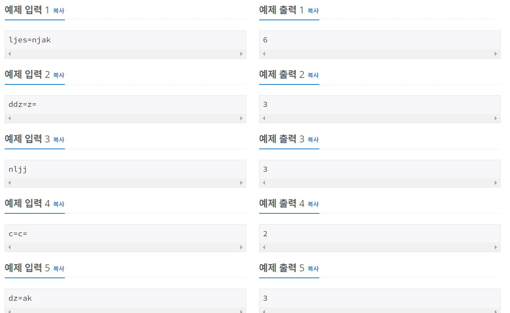

# 알고리즘 공부 6일차

### 백준 문제 :

1152, 2908, 5622, 2941(실패), 1316

---

# 주요 문제 정리

## (실패) 2941. 크로아티아 알파벳

<br/>

> ### [문제](https://www.acmicpc.net/problem/2941)


#### <br/>예를 들어, ljes=njak은 크로아티아 알파벳 6개(lj, e, š, nj, a, k)로 이루어져 있다. 단어가 주어졌을 때, 몇 개의 크로아티아 알파벳으로 이루어져 있는지 출력한다.<br/>dž는 무조건 하나의 알파벳으로 쓰이고, d와 ž가 분리된 것으로 보지 않는다. lj와 nj도 마찬가지이다. 위 목록에 없는 알파벳은 한 글자씩 센다.

<br/>

> ### 예제 입출력



<br/>

> ### 내 코드 (실패)

```python
a = input()
b = ["c=", "c-", "dz=", "d-", "lj", "nj", "s=", "z="]
count = 0
for i in b:
    if a.find(i) != -1:
        count += 1
        a = a.replace(i, "")
print(count + len(a))
```

<br/>

> ### POINT!

## <내가 짠 알고리즘> <br/>

1. 미리 크로아티아 알파벳 리스트를 만든다.
2. 입력받은 문자열에서 크로아티아 알파벳이 있는지 확인 후, 있으면 카운트 + 1 을 하고 문자열에서 제거한다.
3. 더 이상 제거할 크로아티아 알파벳이 없으면 카운트에 남은 문자열의 길이를 더하는 방식으로 알고리즘을 짰다.

## <실패 요인>

예제 입력 3인 "nljj"의 경우, 내가 짠 코드에 대입을 하면 크로아티아 알파벳 "lj"가 문자열에서 제거되면서 남은 "n"과 "j"가 합쳐져 또 다른 크로아티아 알파벳이 의도치않게 만들어지기 때문에 잘못된 답이 나오게 된다. ㅠㅠ

## <해결>

접근은 잘 했지만 내가 replace 함수를 통해 크로아티아 알파벳을 아예 제거를 해버려서 문제가 생긴 것 같다..! 
<br/>알파벳을 제거 하지않고 "\*" 별 문자로 대체를 하면 남은 알파벳이 합쳐져서 크로아티아 알파벳이 되는 문제가 발생하지 않는다. 
<br/>그리고 크로아티아 알파벳이 별 문자 하나로 대체되기 때문에 알파벳의 개수를 세기도 수월해진다! (count 변수를 따로 사용하지 않아도 된다!)

## <수정 코드>

```python
a = input()
b = ["c=", "c-", "dz=", "d-", "lj", "nj", "s=", "z="]
for i in b:
    if a.find(i) != -1:
        a = a.replace(i, "*")
print(len(a))
```

---

<br/>

## 1316. 그룹 단어 체커

<br/>

> ### [문제](https://www.acmicpc.net/problem/1316)

#### 그룹 단어란 단어에 존재하는 모든 문자에 대해서, 각 문자가 연속해서 나타나는 경우만을 말한다. 예를 들면, ccazzzzbb는 c, a, z, b가 모두 연속해서 나타나고, kin도 k, i, n이 연속해서 나타나기 때문에 그룹 단어이지만, aabbbccb는 b가 떨어져서 나타나기 때문에 그룹 단어가 아니다. <br/>단어 N개를 입력으로 받아 그룹 단어의 개수를 출력하는 프로그램을 작성하시오.

<br/>

> ### 예제 입출력


<br/>

> ### 내 코드

```python
import sys
a = int(input())
count = 0
index = []
for _ in range(a):
    b = list(sys.stdin.readline().rstrip())
    index = []
    for i in b:
        index.append(b.index(i))
    if sorted(index) == index:
        count += 1
print(count)
```

<br/>

> ### 풀이과정

우선 이 과제에서 요구하는 그룹 단어의 정의를 생각했다.
<br/>그룹 단어란 `1. 단어에 해당 알파벳이 한번만 등장 2. 두번 이상 등장한다면 연달아 나와야 한다.` 

<br/>   이것을 코드로 어떻게 정리할 수 있을까 생각했다. 처음에 생각한 것은 1번 조건은 문자열을 리스트로 변환 후 세트로 변환하여 세트의 길이가 리스트의 길이와 같을 때를 검사하는 코드를 생각했다. 그러나 2번을 어떻게 검사할 수 있을지 감이 오지 않았다.

<br/>   그러다가 문득 단어에서 해당 알파벳을 찾아주는 `index 함수`를 사용해 각 알파벳이 몇 번째에 위치하는지를 리스트에 넣고 출력해보았다. index 함수는 찾는 값이 리스트에 여러개 존재할 경우 가장 처음 위치하는 인덱스를 반환한다. `happy 의 경우는 [0, 1, 2, 2, 4]` 를 반환한다. 그러나 `hapyp 라면 [0, 1, 2, 3, 2]` 를 반환할 것이다. 여기서 패턴을 발견했다. 1번이나 2번 조건을 만족하는 경우, 즉 그룹단어인 경우 알파벳이 중복되더라도 이웃하기 때문에 인덱스가 오름차순으로 출력될 것이다. 그러나 2번 조건이 만족하지 않을 경우 앞에 나왔던 알파벳이 다른 알파벳을 끼고 뒤에 또 위치하게 된다면, index 함수는 처음 발견한 인덱스를 반환하기 때문에 인덱스는 뒤죽박죽 될 것이다. 그래서 `인덱스 배열이 오름차순일경우 그룹 단어이고, 오름차순이 아닌 경우는 그룹 단어가 아닌것으로 판단할 수 있었다.`

---

<br/>

# 기타 개념 정리

## 파이썬 문자열 뒤집기

1. for문을 사용한다.
2. 리스트 reverse 함수를 사용한다

- 문자열에는 reverse 라는 메서드가 존재하지 않기 때문에 리스트의 reverse 메서드를 사용해야 한다.
- 문자열을 list로 변환한 다음 reverse 함수를 사용하면 된다.

3. 문자열 슬라이싱을 이용한다. `[::-1]`

- 문자열 슬라이싱은 `문자열[시작:끝:규칙]` 형태로 사용한다.
- 규칙에는 1이 들어가는 것이 디폴트이며, 1이 들어가게 되면 문자열을 앞에서부터 하나씩 잘라서 새로운 문자열을 만들어준다.
- 규칙에 2를 넣는다면 한칸씩 띄워서 새로운 문자열을 만들어준다.
- 규칙에 -1을 넣는다면 뒤에서부터 잘라서 새로운 문자열을 만들어준다.
- 예시

```python
a = "HELLO"
print(a[::2])
>> HLO
print(a[::-1])
>> OLLEH
```

## 파이썬 문자열 포함여부 확인하는 법

1. if something in string

   - 예시

   ```python
   str = "Hello world, python"
   if "world" in str:
      print("Found world")
   else:
      print("Not found world")

    >>> Found world
   ```

2. str.find() 함수 이용
   - find()는 문자열에 인자로 전달된 문자열이 존재할 때, 문자열의 위치에 해당하는 index를 리턴한다.
   - 문자열이 존재하지 않으면 -1을 리턴한다.

## 리스트에서 특정 항목 찾기

1. index 메서드를 사용해야 한다.
   - 리스트에서는 find 메서드 대신 index 메서드를 사용해야 한다.
   - 해당 값이 위치한 인덱스를 반환한다.
   - 리스트 안에 찾으려는 항목이 없으면 에러가 발생한다.
2. in 키워드를 사용한다.
   - 예시 : `if 'a' in 리스트: ~`
   - True 나 False 를 반환한다.

## 리스트 정렬하기

1. 리스트.sort() 메서드 사용
   - 원본 리스트의 항목이 정렬된다.
2. sorted(리스트) 메서드 사용
   - 원본 리스트는 건들지 않고, 새로운 리스트를 만들어서 반환한다.
   - `sorted(리스트, reverse = True)` 로 역순정렬도 가능하다.

<br/>

---

<br/>

## 참고

- https://blockdmask.tistory.com/581
- https://codechacha.com/ko/python-find-str-in-str/
- https://pythonia.tistory.com/14
