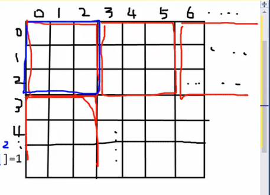

<내 코드>

```python
import sys
#sys.stdin = open("input.txt", "rt")
a = []
result = True
for _ in range(9):
    tmp = list(map(int, input().split()))
    a.append(tmp)

for i in range(0,9,3):
    tmp = []
    for j in range(i, i+3):
        for k in range(0,3):
            tmp.append(a[j][k])
    tmp = set(tmp)
    if len(tmp) != 9:
        result = False
        break

if result == True:
    for i in range(0,9,3):
        tmp = []
        for j in range(i, i+3):
            for k in range(3,6):
                tmp.append(a[j][k])
        tmp = set(tmp)
        if len(tmp) != 9:
            result = False
            break

if result == True:
    for i in range(0,9,3):
        tmp = []
        for j in range(i, i+3):
            for k in range(6,9):
                tmp.append(a[j][k])
        tmp = set(tmp)
        if len(tmp) != 9:
            result = False
            break

if result == True:
    print("YES")
else:
    print("NO")
```

<강의 코드>

```python
import sys
#sys.stdin=open("input.txt", "r")
def check(a):
    for i in range(9): # 행과 열 탐색
        ch1=[0]*10
        ch2=[0]*10
        for j in range(9):
            ch1[a[i][j]]=1
            ch2[a[j][i]]=1
        if sum(ch1)!=9 or sum(ch2)!=9:
            return False
    for i in range(3): # 9개의 그룹 탐색
        for j in range(3):
            ch3=[0]*10
            for k in range(3): # 그룹 안 9개의 숫자 탐색
                for s in range(3):
                    ch3[a[i*3+k][j*3+s]]=1
            if sum(ch3)!=9:
                return False
    return True

a=[list(map(int, input().split())) for _ in range(9)]
if check(a):
    print("YES")
else:
    print("NO")
```

<복습>

```python
import sys
#sys.stdin = open("input.txt", "r")
a = [list(map(int, input().split())) for _ in range(9)]

def check(a):
    #행 열 비교
    for i in range(9):
        tmp1 = tmp2 = set()
        for j in range(9):
            tmp1.add(a[i][j])
            tmp2.add(a[j][i])
        if len(tmp1) != 9 or len(tmp2) != 9:
            return False

    # 3*3 비교
    for i in range(3):
        for j in range(3):
            tmp1 = set()
            for k in range(3):
                for s in range(3):
                    tmp1.add(a[3*i+k][3*j+s])
        if len(tmp1) != 9:
            return False
    return True

if check(a):
    print("YES")
else:
    print("NO")
```

**#15**

i가 0, j가 0 일때는 첫 번째 그룹(3\*3크기)을 가리킨다. (사진에서 파랑색 박스)

i가 0, j가 1 일때는 파랑색 박스의 오른쪽 그룹(3\*3크기)을 가리키게 된다.


<복습2>

```python
import sys
#sys.stdin = open("input.txt", "r")
def check(a):
    for i in range(9):
        tmp1 = [0] * 10
        tmp2 = [0] * 10
        for j in range(9):
            tmp1[a[i][j]]  = 1
            tmp2[a[j][i]]  = 1
        if sum(tmp1) != 9 or sum(tmp2) != 9:
            return False

    for i in range(3):
        for j in range(3):
            tmp1 = [0] * 10
            for s in range(3):
                for k in range(3):
                    tmp1[a[3*i+s][3*j+k]] = 1
            if sum(tmp1) != 9:
                return False
    return True


nums = [list(map(int, input().split())) for _ in range(9)]

if check(nums) == False:
    print("NO")
else:
    print("YES")
```
