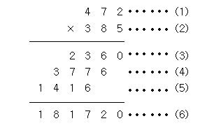

# 2588. 곱셈

> ### [문제](https://www.acmicpc.net/problem/2588){: target="\_blank"}

<br/>



#### (1)과 (2)위치에 들어갈 세 자리 자연수가 주어질 때 (3), (4), (5), (6)위치에 들어갈 값을 구하는 프로그램을 작성하시오.

<br/>

> ### 예제 입력

#### 472 <br/> 385

<br/>

> ### 예제 출력

#### 2360 <br/> 3776 <br/>1416<br/>181720

<br/>

> ### 코드

```python
A = input()
B = input()

print(int(A) * int(B[-1]))
print(int(A) * int(B[-2]))
print(int(A) * int(B[-3]))
print(int(A) * int(B))
```

<br/>

> ### 배운 개념

- ### 파이썬2 vs 파이썬3
  - 파이썬3에서는 int 나누기 결과가 float이다.
  - 파이썬3에서는 print문 괄호가 필수이다.
  - 파이썬3에서는 오버플로우가 없기 때문에 long 타입이 없어지고 int 타입만 남았다.

<br/>

- ### // : 나눗셈 후 소수점 이하를 버리는 연산자

    <br/>

- ### print()문의 sep 옵션
  - sep 옵션을 통해 갈라놓을 문자를 지정할 수 있다.
  - 예시
  ```python
  print('S', 'E', 'P', sep='@')
  >> S@E@P
  print('S', 'E', 'P', sep='\n')
  >> S
     E
     P
  ```

<br/>

- ### 파이썬 문자열 포매팅
  ```python
  s = 'coffee'
  n = 5
  print(f'저는 {s}를 좋아합니다. 하루에 {n}잔 마셔요.')
  >> 저는 coffee를 좋아합니다. 하루에 5잔 마셔요.
  ```

<br/>

- ### 세자리 숫자 각 자리 수 구하기

  ```python
  A = '123'

  #일의 자리 수 구하기
  int(A[2]) #또는
  int(A[-1])
  ```
