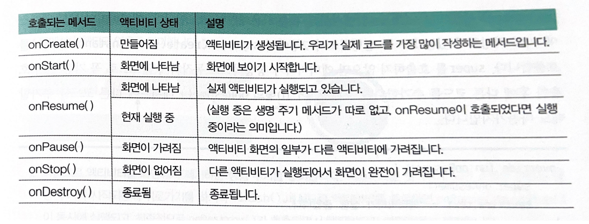

# 액티비티 생명주기

## 액티비티 생명 주기 메서드



- 이 메서드들은 override를 통해서 사용합니다.
- 액티비티의 부모 클래스에 이미 작성되어 있는 코드를 실행하고자 super를 호출합니다. super를 호출하지 않으면 액티비티가 정상적으로 동작하지 않으므로 꼭 가장 먼저 호출한 후에 다른 코드를 추가합니다.
- 예시

```kotlin
override fun onCreate(savedInstanceState: Bundle?){
    super.onCreate(savedInstanceState)
    setContentView(R.layout.activity_main)
}

override fun onStart(){
    super.onStart()
}

...
```

- 생명 주기 메서드를 사용하는 대표적인 예로듣 동영상 플레이어가 있습니다.
- 메인 액티비티에서 동영상을 실행하고 있을 때 서브 액티비티로 화면이 전환된다면 메인 액티비티의 onPause() 또는 onStop() 메서드 안에 동영상을 정지시키는 코드를 작성해둬야 합니다. 그렇지 않으면 그만큼의 자원(배터리, 네트워크 트래픽)이 낭비됩니다.
- 각각의 메서드는 상태 변화에 따라 안드로이드가 호출하므로 activity.onStop()의 형태로 직접 호출해서는 안됩니다.

<br/>

## 생명 주기 콜백의 이해

- 액티비티는 인스턴스 생성과 동시에 생성과 관련된 생명 주기 메서드가 순차적으로 호출됩니다. 그리고 finish() 메서드나 뒤로가기로 액티비티를 종료하면 소멸과 관련된 생명 주기 메서드가 순차적으로 호출됩니다.

1. 액티비티 생성 : onCreate()로 액티비티 생성된 다음 화면 구성 요소를 메모리에 로드하고 onStart()와 onResume()을 통해 화면의 구성요소를 나타내고 사용자와의 상호작용을 시작합니다.
2. 액티비티 제거 : 액티비티를 벗어나게 되면 소멸과 관련된 생명 주기가 시작됩니다. 뒤로가기를 하거나 finish() 메서드로 액티비티를 종료하면 onPause()와 onStop()이 동시에 실행되고, 최종적으로 onDestroy()가 호출되면서 액티비티가 메모리에서 제거됩니다.
3. 새로운 액티비티 생성 : 액티비티를 종료하지 않고 현재 액티비티에서 새로운 액티비티를 실행하면 현재 액티비티의 생명 주기가 onPause()를 거쳐 onStop()까지만 호출되고 종료되지는 않습니다. 그리고 새로 생성된 액티비티는 onStart()와 onResume()을 연속적으로 호출한 후 실행 상태가 됩니다.
4. 새로운 액티비티가 현재 액티비티를 모두 가리지 않고 생성될 때 : onPause()까지만 진행된 후 Paused 상태에서 대기하고, 새로 생성됐던 액티비티가 종료되면 onStart()를 거치지 않고 onResume()이 호출됩니다.
