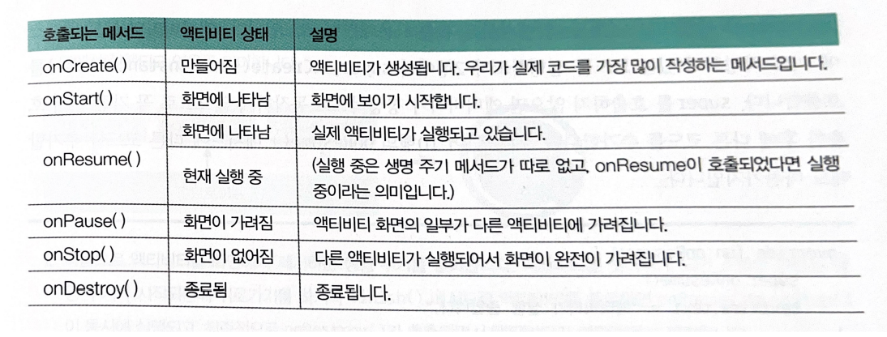

# 생명주기

## 목차

1. [액티비티 생명주기](#액티비티-생명주기)
2. [프래그먼트 생명주기](#프래그먼트-생명주기)

---

<br/>

## 액티비티 생명주기

<br/>

### 액티비티 생명 주기 메서드



- 이 메서드들은 override를 통해서 사용합니다.
- 액티비티의 부모 클래스에 이미 작성되어 있는 코드를 실행하고자 super를 호출합니다. super를 호출하지 않으면 액티비티가 정상적으로 동작하지 않으므로 꼭 가장 먼저 호출한 후에 다른 코드를 추가합니다.
- 예시

```kotlin
override fun onCreate(savedInstanceState: Bundle?){
    super.onCreate(savedInstanceState)
    setContentView(R.layout.activity_main)
}

override fun onStart(){
    super.onStart()
}

...
```

- 생명 주기 메서드를 사용하는 대표적인 예로듣 동영상 플레이어가 있습니다.
- 메인 액티비티에서 동영상을 실행하고 있을 때 서브 액티비티로 화면이 전환된다면 메인 액티비티의 onPause() 또는 onStop() 메서드 안에 동영상을 정지시키는 코드를 작성해둬야 합니다. 그렇지 않으면 그만큼의 자원(배터리, 네트워크 트래픽)이 낭비됩니다.
- 각각의 메서드는 상태 변화에 따라 안드로이드가 호출하므로 activity.onStop()의 형태로 직접 호출해서는 안됩니다.

<br/>

### 생명 주기 콜백의 이해

- 액티비티는 인스턴스 생성과 동시에 생성과 관련된 생명 주기 메서드가 순차적으로 호출됩니다. 그리고 finish() 메서드나 뒤로가기로 액티비티를 종료하면 소멸과 관련된 생명 주기 메서드가 순차적으로 호출됩니다.

  - 1. 액티비티 생성 : onCreate()로 액티비티 생성된 다음 화면 구성 요소를 메모리에 로드하고 onStart()와 onResume()을 통해 화면의 구성요소를 나타내고 사용자와의 상호작용을 시작합니다.
  - 2. 액티비티 제거 : 액티비티를 벗어나게 되면 소멸과 관련된 생명 주기가 시작됩니다. 뒤로가기를 하거나 finish() 메서드로 액티비티를 종료하면 onPause()와 onStop()이 동시에 실행되고, 최종적으로 onDestroy()가 호출되면서 액티비티가 메모리에서 제거됩니다.
  - 3. 새로운 액티비티 생성 : 액티비티를 종료하지 않고 현재 액티비티에서 새로운 액티비티를 실행하면 현재 액티비티의 생명 주기가 onPause()를 거쳐 onStop()까지만 호출되고 종료되지는 않습니다. 그리고 새로 생성된 액티비티는 onStart()와 onResume()을 연속적으로 호출한 후 실행 상태가 됩니다.
  - 4. 새로운 액티비티가 현재 액티비티를 모두 가리지 않고 생성될 때 : onPause()까지만 진행된 후 Paused 상태에서 대기하고, 새로 생성됐던 액티비티가 종료되면 onStart()를 거치지 않고 onResume()이 호출됩니다.

<br/>

---

<br/>

## 프래그먼트 생명주기

- 프래그먼트는 액티비티와 마찬가지로 화면에 보이는 것을 기준으로 생명 주기 메서드를 가집니다.
- 생성에 관련된 5개와 소멸에 관련된 5개를 가지고 있습니다.
  <br/>

### 생성 주기 메서드

- 생성과 관련된 5개의 생명 주기 메서드가 있지만 프래그먼트를 포함하고 있는 액티비티가 화면에 계속 나타나고 있는 상태에서는 onAttach() 부터 onResume()까지의 메서드가 모두 한 번에 호출됩니다.

1. onAttach()

   - 프래그먼트 매니저를 통해 액티비티에 프래그먼트가 추가되고 commit 되는 순간 호출됩니다. var fragment = Fragment() 형태로 생성자를 호출하는 순간에는 호출되지 않습니다.
   - 파라미터로 전달되는 Context로 부터 상위 액티비티를 꺼내서 사용합니다. API 레벨 23 이전에서는 onAttach()메서드의 파라미터로 액티비티를 사용할 수 있었지만 23 이상 부터는 Context만 받도록 변경되었습니다.

2. onCreate()

   - 프래그먼트가 생성됨과 동시에 호출됩니다. 사용자 인터페이스 뷰와 관련된 것을 제외한 프래그먼트 자원(주로 변수)을 초기화할 때 사용합니다.

3. onCreateView()

   - 사용자 인터페이스와 관련된 뷰를 초기화하기 위해 사용됩니다.

4. onStart()

   - 프래그먼트가 새로 add되거나 화면에서 사라졌다가 다시 나타나면 onCreateView()는 호출되지 않고 onStart()만 호출됩니다. 주로 화면 생성 후에 화면에 입력될 값을 초기화하는 용도로 사용됩니다.

5. onResume()
   - onStart()와 같은 용도로 사용됩니다. 다른 점은 소멸 주기 메서드가 onPause() 상태에서 멈췄을 때(현재 프래그먼트의 일부가 가려지지 않았을 때)는 onStart()를 거치지 않고 onResume()이 바로 호출된다는 점입니다.

<br/>

### 소멸 주기 메서드

- 현재 프래그먼트 위로 새로운 프래그먼트가 add되거나 현재 프래그먼트를 제거하면 소멸 주기와 관련된 메서드들이 순차적으로 호출됩니다.

1. onPause()

   - 현재 프래그먼트가 화면에서 사라지면 호출됩니다. 주로 동영상 플레이어를 일시정지한다든가 현재 작업을 잠시 멈추는 용도로 사용됩니다.

2. onStop()

   - onPause()와 다른 점은 현재 프래그먼트가 화면에 일부분이라도 보이면 onStop()은 호출되지 않습니다. 예를 들어 add되는 프래그먼트가 반투명하면 현재 프래그먼트의 생명 주기 메서드는 onPause()까지만 호출됩니다. 동영상 플레이어를 예로 들면 일시정지가 아닌 정지를 하는 용도로 사용됩니다.

3. onDestroyView()

   - 뷰의 초기화를 해제하는 용도로 사용됩니다. 이 메서드가 호출된 후에 생성 주기 메서드인 onCreateView()에서 인플레이터로 생성한 View가 모두 소멸됩니다.

4. onDestroy()

   - 액티비티에는 아직 남아있지만 프래그먼트 자체는 소멸됩니다. 프래그먼트에 연결된 모든 자원을 해제하는 용도로 사용됩니다.

5. onDetach()
   - 액티비티에서 연결이 해제됩니다.
