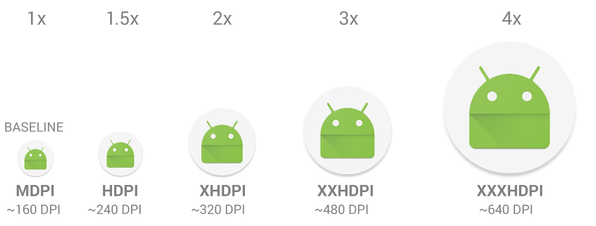
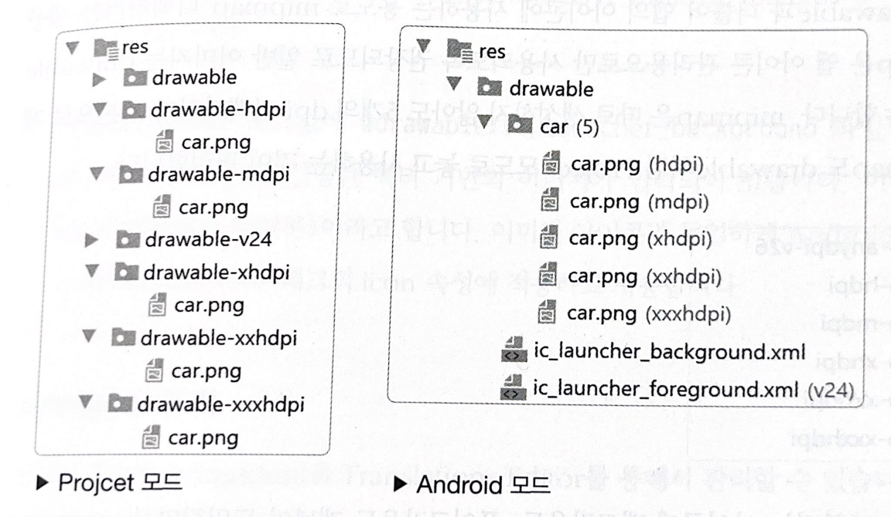

# 리소스 다루기

## drawable

- 안드로이드는 스마트폰마다 가로세로 화소(픽셀)의 개수가 다르기 때문에 사이즈를 표시하는 단위로 가상 화소 개념인 dp를 사용합니다.
- dp는 화면 밀도인 DPI에 따라서 실제 픽셀로 변환되는 크기가 달라지는데, drawable 또한 DPI에 따라서 서로 다른 이름의 디렉터리를 사용합니다.

 

## DPI

- DPI는 가로세로 1인치의 정사각형 공간에 들어 있는 픽셀의 숫자를 나타내는 단위입니다.
- 안드로이드는 160DPI를 기본으로 사용하는데 이를 mdpi라고 합니다.
- mdpi는 스마트폰 화면을 켰을 때 1인치의 사각형 안에 160개의 화소가 그려집니다.
- 안드로이드 스마트폰들은 다음과 같이 6개의 DPI를 사용하고 있습니다. (ldpi는 현재 거의 사용되지 않습니다.)
- android dpi
  

 

## drawable 디렉터리 구성

- 앞에서 설명한 DPI 구조로 인해 각각의 해상도에 맞는 drawable 디렉터리에 이미지를 넣고 사용해야 합니다. 즉, 앱을 개발할 때는 동일한 이미지를 최소 5개의 해상도로 만들어서 사용해야 합니다.
- 디자이너와 함께 작업하면 총 5개의 각 사이즈에 맞는 이미지를 전달해줍니다.
- 예를 들어 car.png 라는 이미지를 사용한다면 다음과 같은 5개의 디렉터리에 같은 이름으로 이미지를 저장합니다.
- directory 구조
  
- 각 디렉터리를 수동으로 생성하려면 Project 모드에서 res 디렉터리를 마우스 우클릭하여 생성할 수 있습니다.
- 이미지 파일을 res/의 적절한 하위 디렉터리에 배치하면 시스템에서 앱이 실행되는 기기의 픽셀 밀도에 따라 자동으로 알맞은 크기를 선택합니다.
- 참고로 drawable-v24 디렉터리의 24는 안드로이드 API 버전을 뜻합니다. 안드로이드 8.0부터 아이콘과 같은 특정 이미지에 background와 foreground로 이미지를 세분화해서 적용하기 위해 생긴 디렉터리 구조입니다. 일반 이미지를 v24에 넣으면 하위 버전 안드로이드에서는 이미지를 볼 수 없는 문제가 발생할 수 있기 때문에 가급적 -v24를 지우고 drawable 디렉터리에 넣어주는게 좋습니다.

## mipmap

- mipmap은 앱 아이콘 관리용으로만 사용되도록 권장되므로 일반 이미지는 drawable에 넣고 사용해야 합니다.
- mipmap은 따로 생성하지 않아도 5개의 dpi 디렉터리가 기본으로 제공됩니다.
- 각각의 디렉터리에 아이콘 이미지를 넣고 AndroidManifest.xml에 있는 <application> 태그의 icon 속성에 설정하면 앱 설치 후 화면에 나타납니다.
